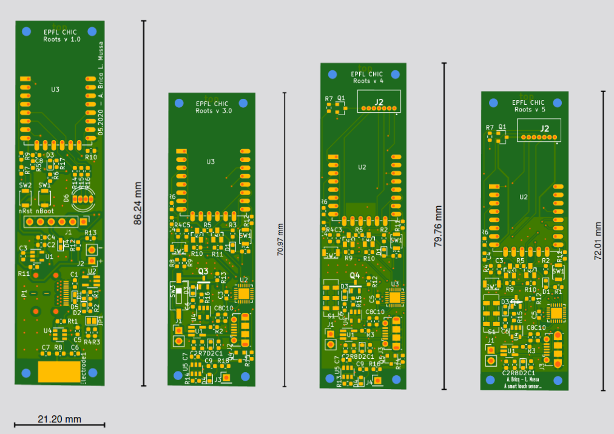

**China Hardware Innovation Center** (CHIC) was a year and a half long project in a team of 5 skilled students (2 engineers, 2 design students and 1 business student), where we had to entirely designed from scracth a **connected device**, in our case a **smart sensor for home plants**, that can transform any plant into a highly sensitive touch sensor and generate beautiful visuals. 

For the first year of the program, we worked on the creation of a sensor (3D printed box, PCBs) which allowed minimal viable performances (the sensor could detect when a plant was being touched). The second year of the program was focused on a much more technical aspect: the development of a **new sensing technology** that uses machine learning to not only detect when a plant (*or actually, any object*) is touched, but to also eventually detect **how or where** the object is being touched. 

<iframe width="560" height="315" src="https://www.youtube.com/embed/_SN1TQER2w4" frameborder="0" allowfullscreen></iframe>

The work involved **many aspects**, a lot of them being technical: programming microcontrollers, designing PCBs and producing them, fast prototyping.

Though we also had to work in a team and this came with its challenges and many opportunites to work my **soft skills**. This project was definitely one of the highlight of my student career at EPFL. 

