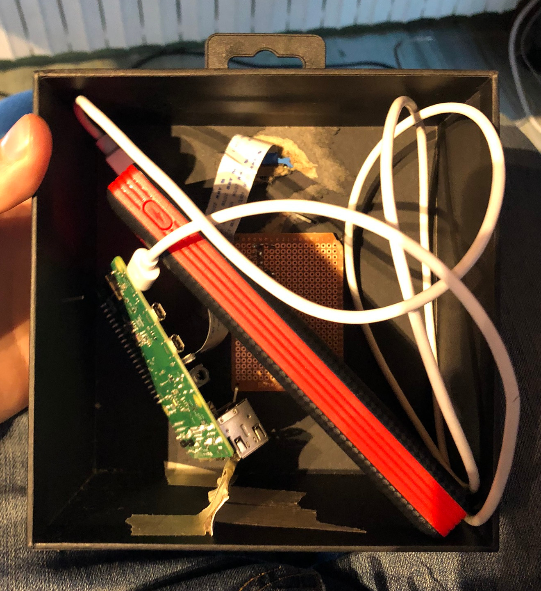

During the lockdown, I was observing at birds at my window and wondering that I'd like to see them from closer. I also happened to be in possetion of a **Raspberry Pi** with a super cool **Pi camera v2.1 NoIR**.

So, with my friend Johan (*You can check out his own website, he is a great physicist and my adventure companion, go at this [link](https://jfelisaz.eu/)*) we decided to 'build' (*that's a big word*) a little box, equippe it with: the raspberry pi, some IR lights that we got from some old remotes, the camera and a phone battery. 

Though it is really not great design (it was mostly for fun), we would take some great pictures of birds and it was a good practise of computer vision. In a few words, the algorithm looked for difference between the **current image** and the **mean image** of the stream. 

