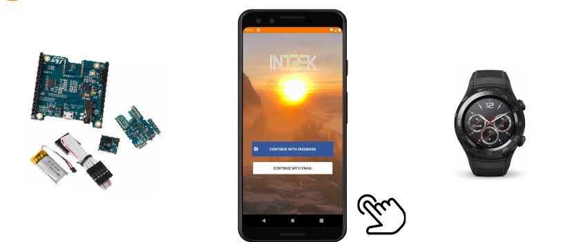
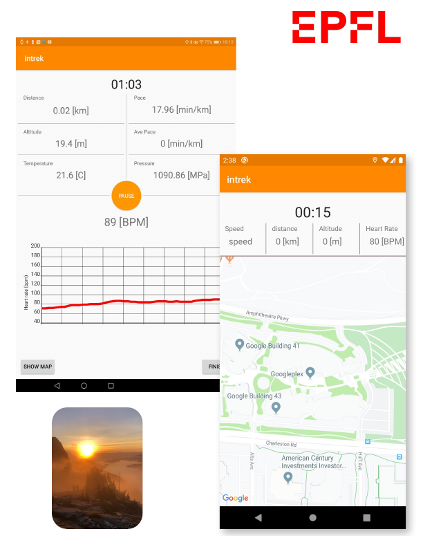

This project was done for a course at EPFL. In a team of 3 students, we developed an mobile app over Android to be your 'hiking partner'. 

The app featured a connection with a **smart-watch** to record data such as **chocs** or **average acceleration**. It also used GPS data to compute **speeds** or **distances**. Here are some layouts from the user experience !

