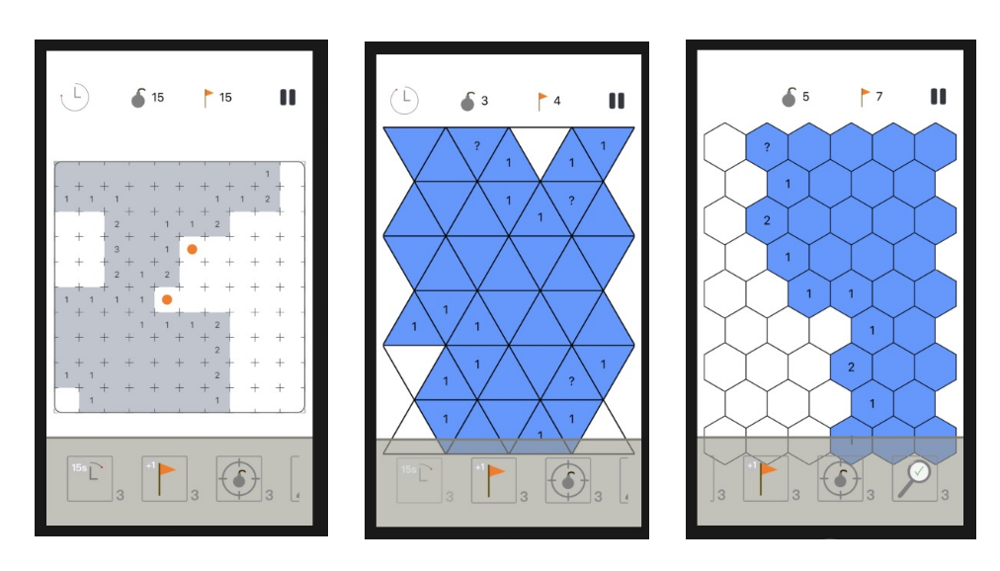

When I started working on this project, I knew not much about programming, Swift, or software construction. It took my brother and I more than a year of learning to have this game. 

It is a remake version of the famous game 'Mine Sweeper' that included the following features:
- 2 new kind of blocks: hexagonals and triangulars 
- infinite games or a story of several puzzles
- additional difficulties

Working with the design of this game was very difficult ! The geometry of the game is really not so trivial when it was about hundreds of triangles. Unfortunately, the game is not available in the AppStore because one has to pay each and every year for that. But you have access to all the code, and it really works !
